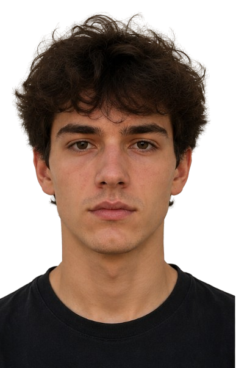
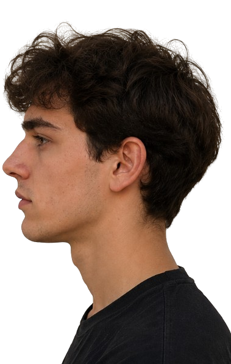
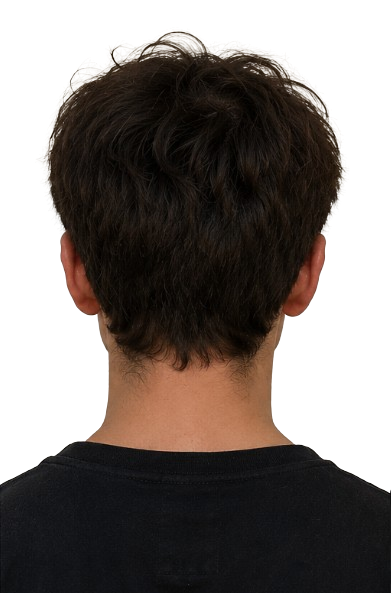
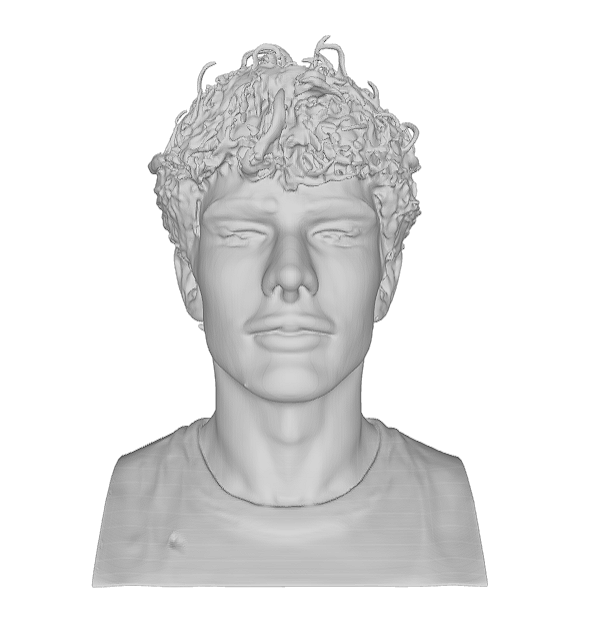
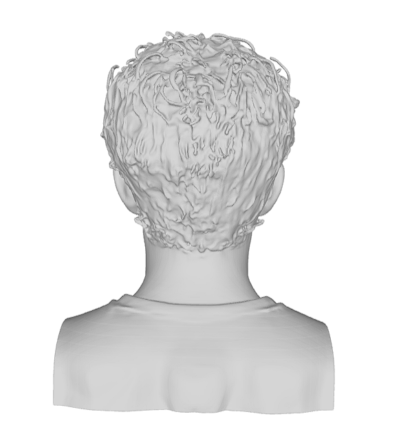
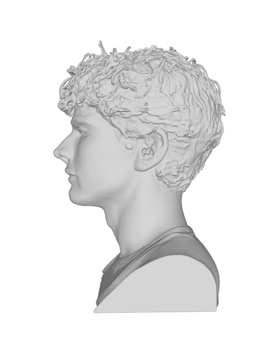

# Image to 3D Bust with Hunyuan3D-2mv

Generate a 3D printable bust from multi-view reference images using Tencent Hunyuan3D-2mv in Google Colab.

## Overview

This project converts front, side, and back reference images into a 3D mesh and exports the result as a printable STL file.

The workflow runs entirely in Google Colab and does not require a local GPU setup.

## Input Images

Prepare three reference images of the same subject:

front.png

left.png

back.png

The images are uploaded manually inside Google Colab using the upload cell.

Example Input

<p align="center">
  
  
  
</p>

<p align="center">
  <b>Front View</b> &nbsp;&nbsp;&nbsp;&nbsp;&nbsp;&nbsp;&nbsp;&nbsp;
  <b>Left View</b> &nbsp;&nbsp;&nbsp;&nbsp;&nbsp;&nbsp;&nbsp;&nbsp;
  <b>Back View</b>
</p>

For best results:

Keep the subject centered.

Use a clean background.

Avoid text, UI elements, borders, and unrelated objects.

Keep the subject at a similar scale in every view.

Use consistent lighting when possible.

## Workflow

1. Open the notebook in Google Colab.
2. Enable a GPU runtime.
3. Install Hunyuan3D-2.
4. Manually upload the reference images.
5. Load Hunyuan3D-2mv.
6. Generate the 3D mesh.
7. Remove disconnected geometry.
8. Export the final mesh as STL.
9. Download `model_clean.stl`.

## Repository Structure

```text
image-to-3d-bust/
│
├── Hunyuan3D_Multiview_Colab.ipynb
│
├── examples/
│   ├── front.png
│   ├── left.png
│   └── back.png
│
├── output/
│   ├── result_preview.png
│   ├── result_preview2.png
│   └── result_preview3.png
│
└── README.md
```

## Output

The notebook generates a 3D printable file named:

`model_clean.stl`

The STL file is generated inside Google Colab and downloaded directly by the user.

The final STL file is not included in this repository because generated meshes can be too large for convenient GitHub storage.

## Example Results

### Front View



### Back View



### Side View



## Requirements

- Google Colab
- GPU runtime
- Python
- PyTorch
- Hunyuan3D-2mv
- Trimesh

## Notes

The generated mesh may require additional cleanup before 3D printing.

Background elements or disconnected geometry may occasionally be interpreted as part of the 3D object.

The notebook includes a basic connected-component cleanup step that keeps the largest mesh component.

For best results, use clear multi-view reference images with minimal background clutter.

## Model

This project uses Tencent's Hunyuan3D-2mv model for multi-view 3D shape generation.
